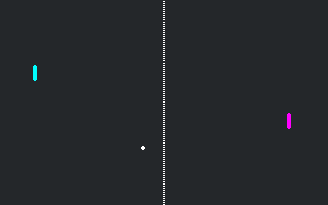

# Pong with Automated Testing Demo

Demo project integrating automated tests with GUT into a template project, developed as part of a series of feasibility tests for my honours project.

Very basic GUT functionality used just to show feasibility - could easily be improved with stubs and parameterized tests.

Originally based on the [official Pong with GDScript Demo](https://godotengine.org/asset-library/asset/121)

## Controls

- 1: Switch to game scene
- 2: Switch to test runner
- W: P1 Up
- S: P1 Down
- Up: P2 Up
- Down: P2 Down

## Screenshots
[View preview vid](https://youtu.be/zEXdRJyfuVg)

